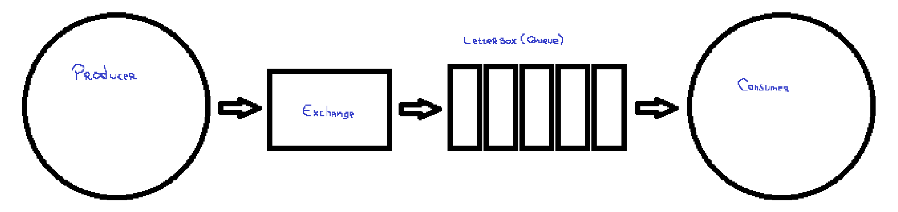

O Exemplo 1, implementa uma simples comunicação, entre o Producer e o Consumer, onde o Producer se conecta ao Consumer pelo RabbitMQ e é publicada uma mensagem contendo um "hello world!" na fila do tipo FIFO chamada de letterbox, logo após, o consumer consome o conteúdo da fila, recebendo assim a mensagem.
